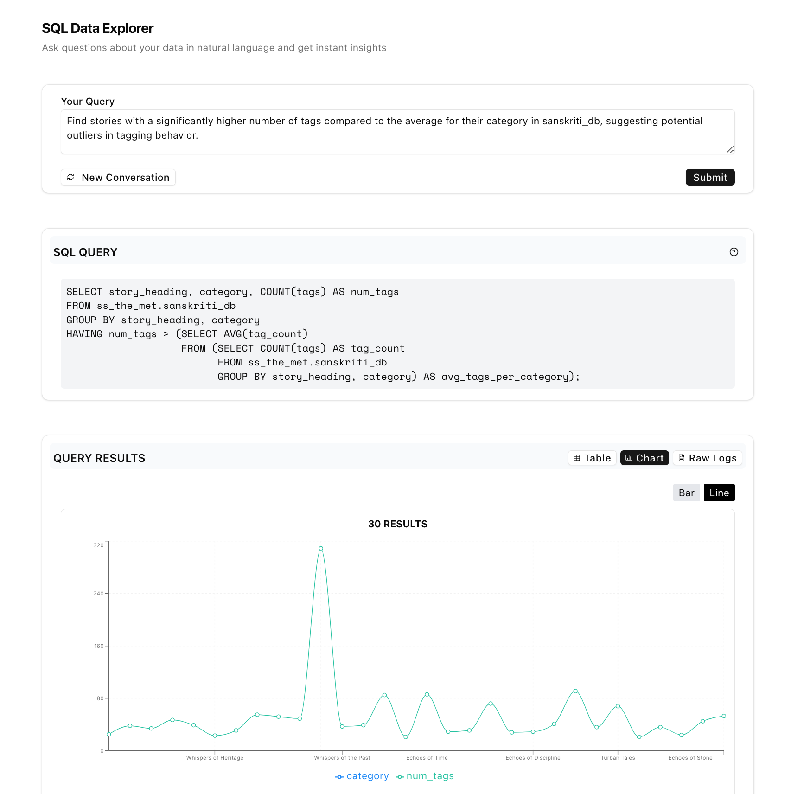
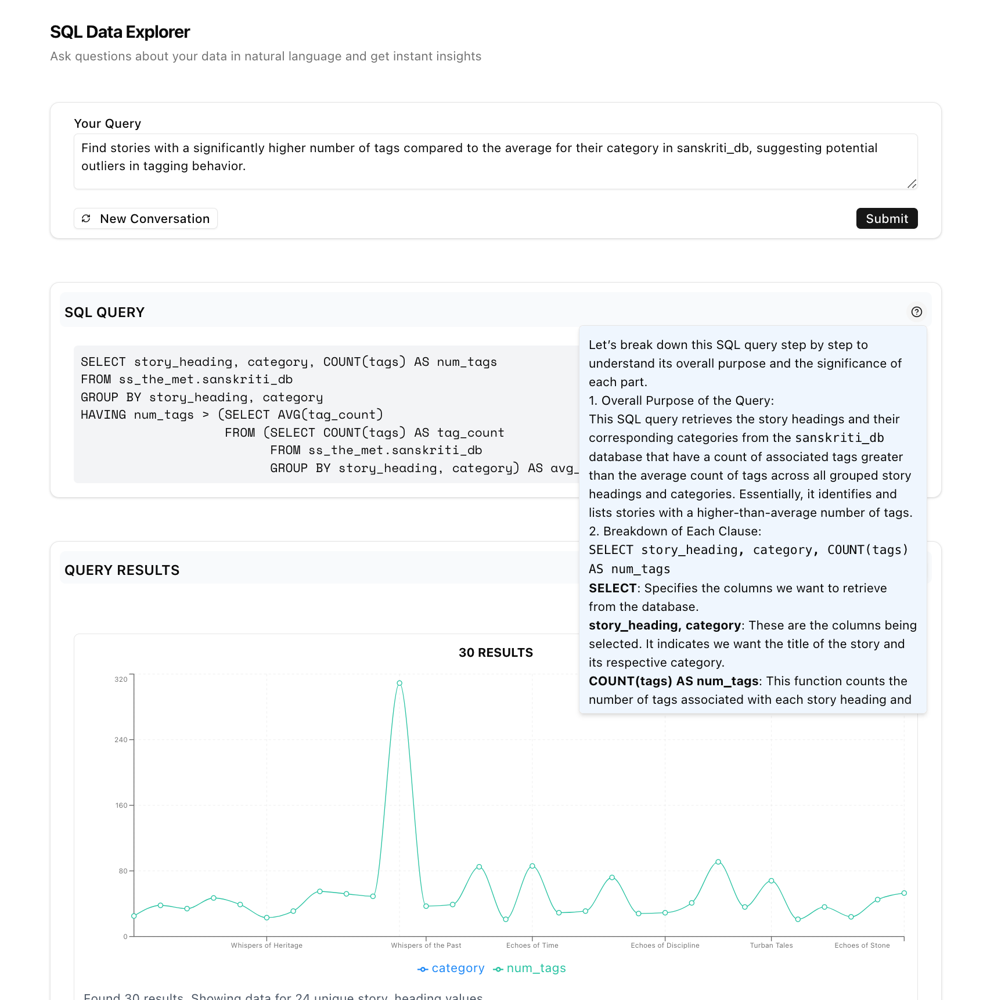
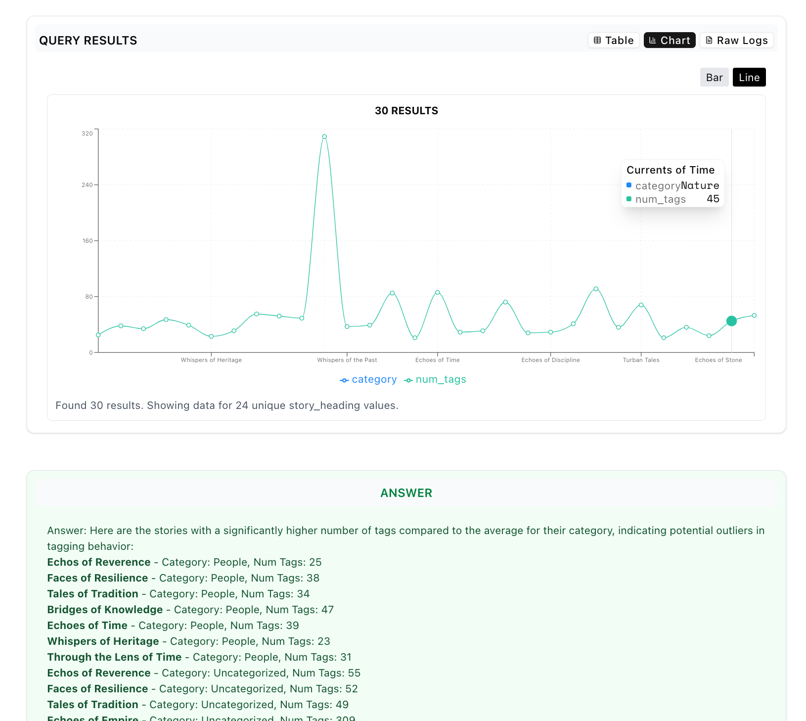
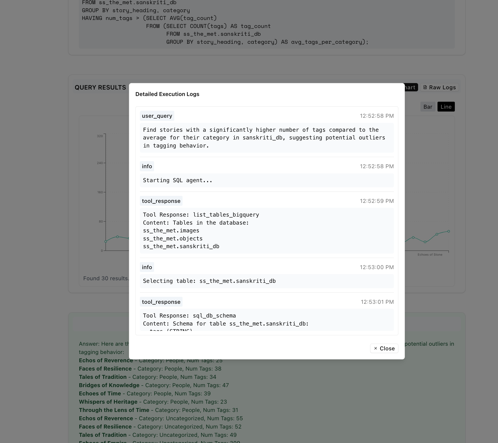

<div style="padding:18px">
<p align="center">
    
    <h1 align="center" style="letter-spacing:24px;font-size:32px;">PIKASO</h1>
    <h1 align="center" style="letter-spacing:18px;font-size:18px;">SQL AGENT</h1>
</p>
  <a href="https://github.com/sinhaGuild">
    <p align="center" style="font-weight:normal;text-underline-offset:8px;font-style:italic;">by sinhaguild</p>
  </a>
    <hr style="border-top:8px solid #bbb;border-radius:5px;" />
</div>

## Introduction

# SQL Agent
This application features:
- Natural langugage to SQL Generation and execution.
- Autocomplete feature which introspects attached databases at component mount. Helps users write SQL queries more efficiently.
- Data Extraction and charting
- SQL Query Explanation
- Summary Reducer
- Robust SQL validation
  1) Added syntax validation using `node-sql-parser`
      - Catches syntax errors before execution
      - Provides detailed error messages for refinement
  2) Query Type Safety
      - Ensures queries are read-only (`SELECT` only)
      - Prevents any data modification operations
      - Falls back to safe queries when needed
  3) Dry Run Execution
       - Added BigQuery dry run validation
       - Tests queries without executing them
       - Catches BigQuery-specific errors early
  4) Schema Compatibility Check
     - Validates queries against table schemas
     - Ensures referenced tables and columns exist
     - Provides warnings for potential schema issues
  5) Query Complexity Limits
     - Prevents overly complex queries
     - Limits joins and nested subqueries
     - Avoids performance issues with large datasets
  6) Iterative Query Refinement
     - Implements AI-powered query correction
     - Uses LLM to fix invalid queries
     - Supports multiple refinement attempts
  7) Robust Fallback Mechanisms
     - Gracefully handles validation failures
     - Falls back to simple, safe queries
     - Ensures users always get some results


## Technology Stack used
- `Next.js`
- `@google-cloud/bigquery` for BQ integration
- `@langchain/core`
- `@langchain/langgraph`
- `@langchain/openai`
- `@microsoft/fetch-event-source` for Live Streaming
- `ZOD` for Type asserts
- `ShadCN` components

## How to use

### Authentication
This application relies on locating your google credentials using ADC. This means if you haven’t explicitly set the GOOGLE_APPLICATION_CREDENTIALS environment variable, the library will automatically use the credentials from your gcloud CLI (assuming you’re authenticated via `gcloud auth login`) or the credentials provided by the runtime environment (e.g., Compute Engine IAM credentials). 

Run the below command to login to your gcloud instance which has a BigQuery database configured with datasets you'd like to query.

```sh
gcloud auth application-default login
```

### Setup `projectId`

You can set the `GOOGLE_PROJECT_ID` environment variable in your terminal or create a `.env` file in the root of the project. Set this project to be the one where you have BigQuery configured.

```sh
export GOOGLE_PROJECT_ID="your-project-id"

or 

touch .env
echo "GOOGLE_PROJECT_ID=your-project-id" >> .env
```

### Run the application
```sh
pnpm i
pnpm dev
```

## Screens

  
  
  
  


## Demo

### Application Demo
https://github.com/user-attachments/assets/f9a665f8-09f8-44f5-aaa1-a5769b5fc47d

### Autocomplete
https://github.com/user-attachments/assets/c9302333-4610-4565-a50e-424ca8042263


